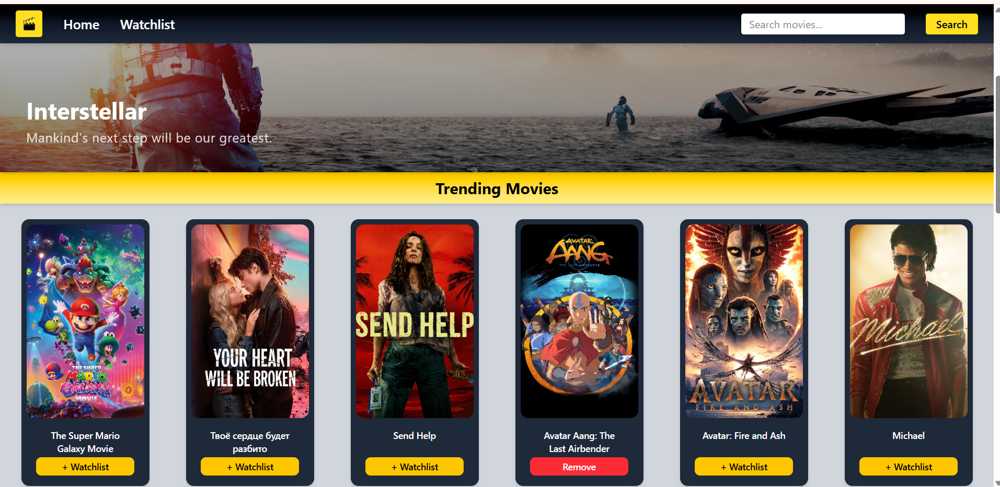

# 🎬 MyWatchlistX

A responsive movie watchlist app built with React and Vite, powered by the TMDB API. Users can browse trending movies, search by title, filter by genre, and manage a personal watchlist — all persisted in local storage.

**Live Demo → [mywatchlistx.netlify.app](https://mywatchlistx.netlify.app)**



---

## Features

- 🔍 **Search** — Find any movie by title using the TMDB API
- 🎭 **Dynamic Genre Filter** — Genre tabs update automatically based on movies in your watchlist
- ➕ **Add / Remove Watchlist** — One-click add or remove, persisted in localStorage
- 📄 **Pagination** — Browse trending movies across multiple pages
- 🎞️ **Hero Banner** — Highlights a featured trending movie with backdrop
- 📱 **Responsive Design** — Works across desktop and mobile

---

## Tech Stack

| Technology | Purpose |
|---|---|
| React 18 | UI framework |
| Vite | Build tool & dev server |
| Axios | HTTP client for TMDB API calls |
| TMDB API | Movie data, posters, banners |
| localStorage | Watchlist persistence |
| Netlify | Deployment & hosting |

---

## Getting Started

### Prerequisites

- Node.js v18+
- A free [TMDB API key](https://www.themoviedb.org/settings/api)

### Installation

```bash
# Clone the repository
git clone https://github.com/shankhadwip/watchlist-app.git
cd watchlist-app

# Install dependencies
npm install

# Create a .env file in the root
echo "VITE_TMDB_API_KEY=your_api_key_here" > .env

# Start the development server
npm run dev
```

App runs at `http://localhost:5173`

---

## Project Structure

```
watchlist-app/
├── public/
│   └── _redirects          # Netlify SPA routing fix
├── src/
│   ├── components/
│   │   ├── Banner.jsx       # Hero banner with featured movie
│   │   ├── GenreIDs.js      # Genre ID to name mapping
│   │   ├── Navbar.jsx       # Navigation + search bar
│   │   ├── Search.jsx       # Search functionality
│   │   └── WatchList.jsx    # Watchlist page with genre filter
│   ├── App.jsx              # Root component + routing
│   └── main.jsx             # Entry point
├── .env                     # API key (not committed)
├── index.html
├── vite.config.js
└── package.json
```

---

## Environment Variables

Create a `.env` file in the root directory:

```
VITE_TMDB_API_KEY=your_tmdb_api_key_here
```

> ⚠️ Never commit your `.env` file. It is already included in `.gitignore`.

---

## Deployment

This app is deployed on **Netlify** from the `main` branch.

The `public/_redirects` file handles client-side routing:
```
/*  /index.html  200
```

---

## Author

**Shankhadwip Talukdar**
- GitHub: [@shankhadwip](https://github.com/shankhadwip)

---

## Acknowledgements

- [TMDB API](https://www.themoviedb.org/) for movie data and images
- [Netlify](https://www.netlify.com/) for hosting